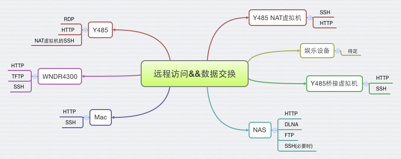

## 远程访问使用

计划中的数据访问图如下：

### 数据传递方式很多

因为多台设备同时使用，会出现版本碎片化的情况，故计划在传递小文件的时候，一律使用Git(HTTP or SSH)来互相传递数据文件；大文件采取HTTP或者U盘/硬盘对拷(USB 3.0还是有优势的)。

	Y485和Mac互相隔离，仅支持一部分数据互相访问

- Windows访问OSX
	- 使用各自的HTTP
	- Y485使用SSH或SSH客户端访问Mac
- OSX访问Windows
	- Mac使用SSH访问桥在Y485上的虚拟机（虚拟机和宿主部分数据共享）
	- Mac使用HTTP访问Y485公开部分的数据
	- Mac使用RDP连接Y485
- 桥接虚拟机
	- Linux提供SSH/Socket/HTTP
	- Windows使用宿主HTTP共享数据
- NAT虚拟机
	- 对宿主进行扩展，使用SSH共享宿主数据
	- 提供HTTP
- 手机访问其他设备
	- HTTP/SSH/RDP
- 常规线缆链接
- 移动媒体复制

### 部分方案选择原因

- 为何不在Y485上使用SSH服务程序直接提供SSH？
	- 2012年的时候，曾经在Win2K3服务器上使用SSH客户端来配合Git进行网站自动化部署，但是因为除了SSH客户端外，还需要配合一个阉割版的Linux Bash环境，用的甚是不爽，与其如此，不如模拟一个完整版的，而且也费不了多少资源。
- 为何基本都提供了HTTP接口？
	- 因为开发需要，但是并不是必选的。
- Mac似乎没有被支持远程图形化访问
	- 是的，因为Mac是主要工作环境（有时抱着上床），Y485被设定为服务提供机器（扔在偏远桌角），当括号里内容出现的时候，唯一需求是Mac控制Y485。
- 手机RDP/SSH是怎么回事？
	- 在外面的时候，操作一些挂机操作的备用方案，当然，如果有笔记本的话，是轮不到手机出马的。

### 待定的方案

- [] 是否抛弃使用Teamview
- [] 是否使两台笔记本Git数据Resync，基准是谁。

